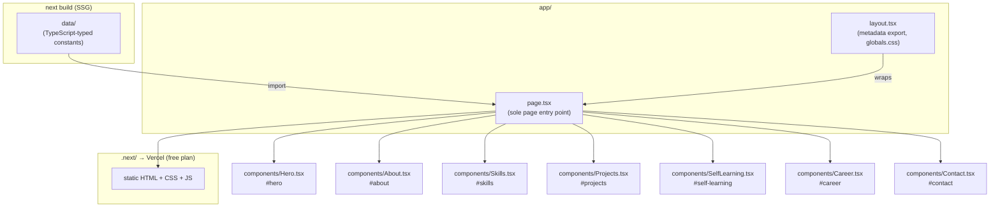
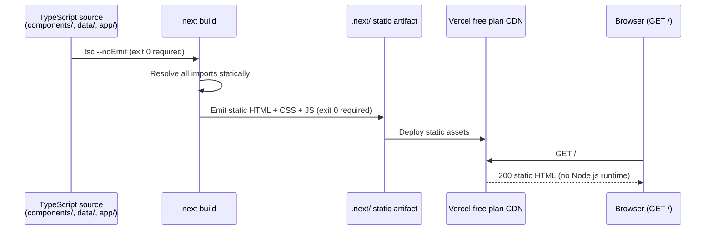
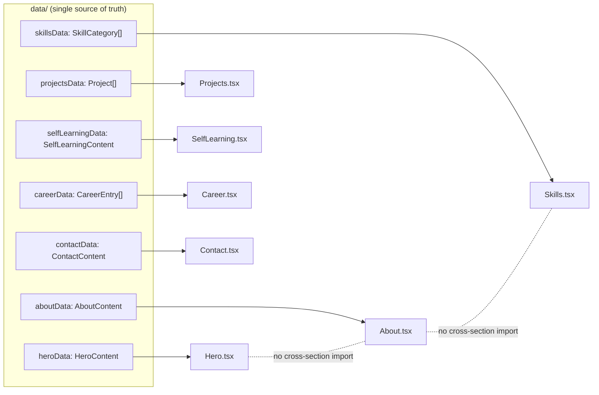
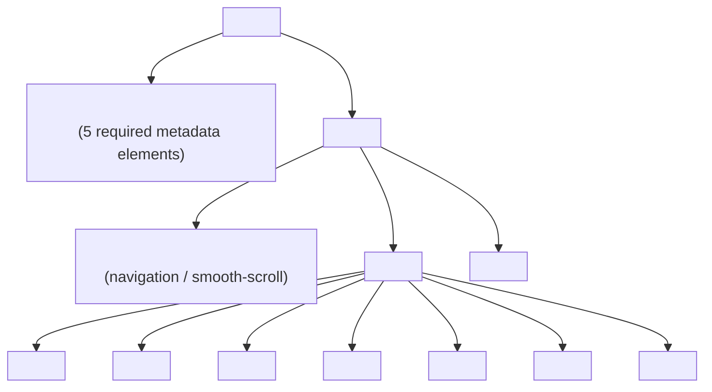

---
codd:
  node_id: design:component-architecture
  type: design
  depends_on:
  - id: design:system-overview
    relation: depends_on
    semantic: technical
  depended_by:
  - id: plan:implementation-plan
    relation: depends_on
    semantic: technical
  conventions:
  - targets:
    - module:hero
    - module:about
    - module:skills
    - module:projects
    - module:career
    - module:contact
    reason: Each section must be an independent React Server Component under components/;
      no cross-section shared mutable state is permitted.
  - targets:
    - module:app
    reason: app/page.tsx is the sole page entry point; additional page routes are
      out of scope.
  - targets:
    - module:projects
    - module:skills
    - module:career
    reason: All content must be declared as TypeScript-typed constants in source;
      runtime data fetching is prohibited and breaks SSG.
  modules:
  - hero
  - about
  - skills
  - projects
  - career
  - contact
  - app
---

# Component Architecture and Data Flow

## 1. Overview

`portforio-v2` is a statically generated single-page portfolio site built on Next.js 16 App Router. The component architecture is organized around a single route (`/`) composed of seven independent content sections, each implemented as a dedicated React Server Component. `app/page.tsx` is the sole page entry point; no additional routes are in scope.

All seven sections — `module:hero`, `module:about`, `module:skills`, `module:projects`, `module:self_learning`, `module:career`, and `module:contact` — are rendered as sequential siblings under `<main>` in `app/page.tsx`. Each section maps 1:1 to a component file under `components/` and is identifiable via its `id` attribute for smooth-scroll navigation. Omitting any section is a release blocker (FC-01).

**Release-blocking constraints enforced by this architecture:**

| Constraint | Module Target | Enforcement |
|---|---|---|
| Independent RSC, no shared mutable state | `module:hero` … `module:contact` | Each component is a pure function; no shared Context, store, or mutable ref crosses section boundaries |
| `app/page.tsx` as sole page entry point | `module:app` | No additional files under `app/` define a `page.tsx`; any additional page route is a scope violation |
| Content declared as TypeScript-typed constants | `module:projects`, `module:skills`, `module:career` | `data/` directory holds typed constants; `fetch()`, database calls, or dynamic `import()` with network I/O are prohibited |

Data flows strictly downward from `data/` constants through `app/page.tsx` into each section component. There is no client-side state management, no React Context crossing section boundaries, and no runtime data fetching at any layer.

---

## 2. Mermaid Diagrams

### 2.1 Component Tree and Data Flow



`app/page.tsx` is the single owner of section composition order. It imports typed constants from `data/` and passes them as props to each section component. No section component imports from another section component, and no section component reads from a shared mutable store. `app/layout.tsx` owns global styles and the five required `<head>` metadata elements (`metadata.title`, `metadata.description`, `metadata.openGraph.title`, `metadata.openGraph.description`, `metadata.openGraph.images`); it does not participate in section data flow.

### 2.2 SSG Rendering Pipeline



`next build` must exit with code 0. Any TypeScript type error, unresolved import, or missing configuration that causes a non-zero exit is a release blocker (FC-07, FC-08). `tsc --noEmit` must also exit 0 as a pre-test step. The output is pure static HTML served by Vercel's CDN; there is no Node.js process at request time.

### 2.3 Section Module Dependency Isolation



Each section component has exactly one data dependency: its own typed constant from `data/`. No section component imports from another section component. This isolation is the structural guarantee that cross-section shared mutable state cannot exist. If a type needs to be shared (e.g., a `Tag` type used by both `Skills.tsx` and `Projects.tsx`), it is declared once in `data/types.ts` and imported by both — never re-declared in a component file.

### 2.4 Semantic HTML Landmark Structure



The rendered HTML must contain exactly one `<header>`, one `<main>`, at least seven `<section>` elements (one per content module), and one `<footer>`. Absence of any landmark is a release blocker (FC-06). The `id` attribute on each `<section>` is required for smooth-scroll navigation and for Playwright selector targeting in E2E tests.

---

## 3. Ownership Boundaries

### 3.1 Module Ownership Table

| Module | Owner File | Data Source | Owned Content |
|---|---|---|---|
| `module:app` | `app/page.tsx` | Imports from `data/` | Section composition order, `<main>` wrapper |
| `module:layout` | `app/layout.tsx` | Static metadata constants | `<head>` metadata (5 elements), `globals.css` import, `<html>` / `<body>` wrappers |
| `module:hero` | `components/Hero.tsx` | `data/heroData.ts` | Full name "西川 駿", one-line self-introduction, GitHub profile link, smooth-scroll navigation element |
| `module:about` | `components/About.tsx` | `data/aboutData.ts` | Career summary, non-IT to IT career-change narrative, current role overview |
| `module:skills` | `components/Skills.tsx` | `data/skillsData.ts` | Skills in exactly 3 categories: languages/frameworks, infra/cloud, dev tools |
| `module:projects` | `components/Projects.tsx` | `data/projectsData.ts` | Exactly 3 project cards with overview/problem/solution/result, technology tags, GitHub links |
| `module:self_learning` | `components/SelfLearning.tsx` | `data/selfLearningData.ts` | Self-directed learning content (multi-agent AI development environment, multi-agent-shogun) |
| `module:career` | `components/Career.tsx` | `data/careerData.ts` | Timeline with exactly 3 company entries |
| `module:contact` | `components/Contact.tsx` | `data/contactData.ts` | GitHub profile link (`href` containing `github.com`), visible email address or `mailto:` link |

### 3.2 Data Ownership

`data/` is the sole canonical source of all content. No component file may declare inline content strings or arrays that represent business data (project names, career entries, skill lists). Components are responsible only for rendering the shape they receive from their corresponding data file.

The following data constants must be TypeScript-typed. Runtime data fetching against these modules is a release blocker:

- `data/skillsData.ts` → `SkillCategory[]` with exactly 3 elements
- `data/projectsData.ts` → `Project[]` with exactly 3 elements
- `data/careerData.ts` → `CareerEntry[]` with exactly 3 elements

Numeric count assertions in tests use strict equality (`=== 3`), not `>= 3`. Violating the exact count is a release blocker (FC-11 for projects, FC-12 for career entries).

### 3.3 Type Ownership

All shared TypeScript interfaces and type aliases are declared in `data/types.ts`. Section components import types from `data/types.ts`; they do not re-declare types locally. This prevents type drift between the data layer and rendering layer. `tsconfig.json` with `strict: true` enforces that all imports are resolved and all prop types are explicitly annotated.

### 3.4 Test Ownership

Each section module is covered by a non-overlapping test pair under `tests/e2e/`: an API integration spec (`*.spec.ts`) and a browser spec (`*.browser.spec.ts`). Shared Playwright utilities are owned exclusively by `tests/e2e/helpers/`:

| Helper | Owner | Responsibility |
|---|---|---|
| `server-health.ts` | `tests/e2e/helpers/` | `waitForServer(url)` — asserts GET returns `< 500` |
| `html-parser.ts` | `tests/e2e/helpers/` | `getHead(html)`, `getMetaContent(html, name/property)` |
| `dom-assertions.ts` | `tests/e2e/helpers/` | `assertNoOverflow(page, selector)`, `assertAltText(page)` |
| `axe-runner.ts` | `tests/e2e/helpers/` | `runAxe(page)` — returns `critical`/`serious` violations only |
| `viewport-presets.ts` | `tests/e2e/helpers/` | `MOBILE = { width: 375, height: 812 }`, `DESKTOP = { width: 1280, height: 800 }` |

No section spec file may reimplement logic already in a helper. Any addition to helpers is a shared change and must not break existing spec files.

---

## 4. Implementation Implications

### 4.1 React Server Components — No Client State

All seven section components (`Hero.tsx`, `About.tsx`, `Skills.tsx`, `Projects.tsx`, `SelfLearning.tsx`, `Career.tsx`, `Contact.tsx`) are React Server Components by default under Next.js 16 App Router. They must not include `'use client'` directives unless a specific interactive behavior (e.g., scroll event listener for smooth navigation) requires client-side execution. Any `'use client'` boundary must be narrow, scoped to the minimal sub-component that needs interactivity, and must not receive cross-section state as props.

The prohibition on cross-section shared mutable state means: no React Context provider wrapping multiple sections, no Zustand/Jotai/Redux store, no `useRef` shared between sections. Each section is a pure render of its own data constant.

### 4.2 TypeScript Strict Mode Implications

`tsconfig.json` enforces `strict: true`. Implementation implications:

- All component props must be explicitly typed; no `any` in component interfaces.
- `data/types.ts` must export interfaces for `HeroContent`, `AboutContent`, `SkillCategory`, `Project`, `SelfLearningContent`, `CareerEntry`, and `ContactContent`.
- `Project` must include fields for overview, problem, solution, result (strings), technology tags (`string[]`), and a GitHub URL (`string`).
- `CareerEntry` must include at minimum company name, employment period, and role description.
- `SkillCategory` must include a category name and a list of skill names.
- CI must reject any `.js` or `.jsx` file introduced into `components/`, `data/`, or `app/`. All configuration files (`next.config.ts`, `tailwind.config.ts`) are TypeScript.

### 4.3 Static Content Constraints for `module:projects`, `module:skills`, `module:career`

These three modules have a hard constraint: content must be declared as TypeScript-typed constants in source; runtime data fetching is prohibited and breaks SSG.

Concretely:

- `data/projectsData.ts` must export a `const projectsData: Project[]` with exactly 3 elements. The three projects are: (1) 既存ふるさと納税サイトの ECS + Laravel へのリアーキテクチャ推進 (tags: AWS ECS, Laravel, Docker), (2) シリアルコード型ふるさと納税サイト・CMS の新規開発 (tags: Next.js, Laravel, BFF), (3) 開発環境のコンテナ化・標準化と DX 向上 (tags: Docker, Docker Compose).
- `data/skillsData.ts` must export exactly 3 `SkillCategory` objects corresponding to languages/frameworks, infra/cloud, and dev tools.
- `data/careerData.ts` must export exactly 3 `CareerEntry` objects.

`fetch()`, `axios`, database drivers, or any I/O inside these data files cause `next build` to fail or produce a non-static page, which is a release blocker (FC-07).

### 4.4 Responsive Layout at 375px

Tailwind CSS breakpoints are mobile-first. All section components must be authored assuming a 375px base width. The following are measurable release-blocking thresholds:

- `document.documentElement.scrollWidth <= 375` at viewport width 375px — measured via `page.evaluate()` in `tests/e2e/responsive.browser.spec.ts` (FC-04).
- All 3 project cards must stack vertically (single column) at 375px.
- No horizontal scrollbar may appear at 375px.
- `next/image` components must specify explicit `width` and `height` props to prevent CLS.

Tailwind grid/flex classes used in `Projects.tsx` must default to `grid-cols-1` and promote to multi-column only at `md:` (768px) or `lg:` (1024px).

### 4.5 Accessibility Constraints

- Zero axe-core `critical` or `serious` violations are required for release (AC-11).
- All `` elements rendered by `next/image` or raw `` tags must carry non-empty `alt` attributes. Empty `alt=""` is permitted only for purely decorative images with no content value; all content images require descriptive `alt` text. Violation is a release blocker (FC-05).
- The semantic landmark structure (`<header>`, `<main>`, 7× `<section>`, `<footer>`) is enforced by `tests/e2e/sections-presence.spec.ts`. Missing any landmark is a release blocker (FC-06).

### 4.6 OGP and Metadata

`app/layout.tsx` exports a single `metadata` constant using the Next.js 16 Metadata API. All five required elements must be non-empty:

```typescript
export const metadata: Metadata = {
  title: '...',
  description: '...',
  openGraph: {
    title: '...',
    description: '...',
    images: ['/og-image.png'],
  },
};
```

`public/og-image.png` must be committed to the repository and exist in the build artifact. Its absence or an HTTP 4xx/5xx response for the `og:image` URL is a release blocker (FC-03). No other component file may export a `metadata` object; `app/layout.tsx` is the sole owner of site-wide metadata.

### 4.7 Vercel Free Plan Deployment Constraints

The build artifact produced by `next build` must be deployable on the Vercel free plan with no configuration that activates Edge Functions or ISR beyond free-plan limits. Before each production deployment, the Vercel project settings must be verified to confirm no paid-tier features are enabled (F-002). The CI startup sequence uses `npm run build && npm start`, which targets `.next/` output mode with `next start`; this is relevant to OQ-001 (see Section 5).

### 4.8 E2E Test Quality Gate

A test run is release-eligible only when all of the following hold simultaneously:

- Zero failing tests; zero `test.skip()`.
- AC-01 through AC-13 scenarios covered.
- AC-01, AC-09, AC-10, AC-11 passing without exception.
- Zero HTTP 5xx responses observed.
- Zero axe-core `critical` or `serious` violations.
- `tsc --noEmit` exits 0.
- `next build` exits 0.

Every HTTP response assertion in `*.spec.ts` files must assert `response.status() < 500` before checking business-logic conditions.

---

## 5. Open Questions

| # | Question | Impact | Source |
|---|---|---|---|
| OQ-001 | `next.config.ts` must specify either `output: 'export'` (produces `out/` for portable static export) or default SSG mode (produces `.next/` served by `next start`). The CI startup sequence uses `next start`, implying `.next/` mode, but `output: 'export'` produces a more portable artifact for Vercel static hosting. The choice affects Vercel build output detection and whether `next start` remains the correct serve command. This must be resolved before the first deployment to avoid a broken CI or Vercel configuration. | Build pipeline, Vercel deployment configuration, CI startup sequence | OQ-001 from system_overview.md; ADR-001-A (F-001) |
| OQ-002 | `data/types.ts` is the proposed single owner for all shared TypeScript interfaces. If individual data files (e.g., `data/projectsData.ts`) export both data and types, there is a risk of type duplication. The convention — types in `data/types.ts`, data in `data/*Data.ts` — must be documented in a CLAUDE.md or equivalent to prevent drift as the data layer grows. | Type consistency, TypeScript strict-mode compliance | Derived from convention §3.3 |
| OQ-003 | The Self-Learning section (`module:self_learning`) is listed as one of the seven mandatory sections by FC-01 and AC-01, making the canonical section count seven. However, some AC tables list only six sections without Self-Learning. The count of 7 is the operative value — but the acceptance criteria document must be audited to confirm that `#self-learning` appears in every relevant assertion to prevent a silent pass on a count of 6. | Test assertion correctness, release-blocking section count | OQ-003 from system_overview.md; AC-01, FC-01 |
| OQ-004 | `public/og-image.png` has no specified dimensions, aspect ratio, or file-size constraint. Twitter/X requires 1200×630px for summary cards; LinkedIn has similar requirements. Without a formal specification, the image may render poorly on target SNS platforms even if FC-03 passes. The OGP image specification should be formalized with concrete dimensions (recommended: 1200×630px) before the first public deployment. | SEO, OGP rendering quality on Twitter/X and LinkedIn | OQ-004 from system_overview.md; AC-09, FC-03 |
| OQ-005 | The contact section displays the author's email address as static content. Plain `mailto:` is acceptable under the current no-backend constraint, but exposes the address to email scrapers. If the author decides to obfuscate the address (e.g., HTML entity encoding, JavaScript-rendered display), the E2E test for the contact section (`tests/e2e/contact.spec.ts`) must be updated to assert the obfuscated form rather than a raw `mailto:` href. The chosen approach must be documented before the contact section is finalized. | Privacy, spam risk, test assertions | OQ-002 from system_overview.md; AC-08, FC-10 |
