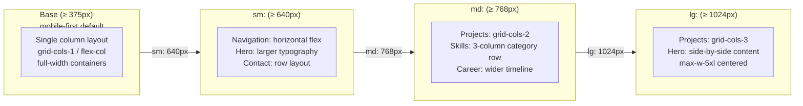
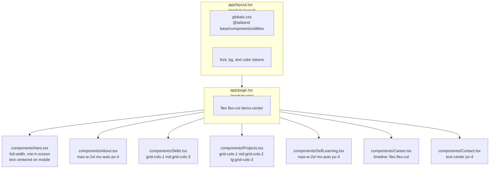
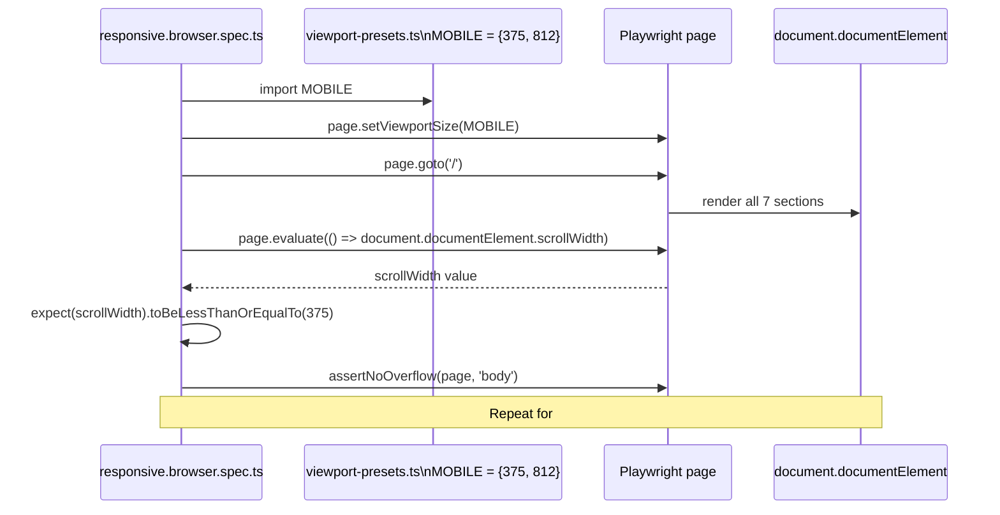

---
codd:
  node_id: design:responsive-layout-design
  type: design
  depends_on:
  - id: design:system-overview
    relation: depends_on
    semantic: technical
  - id: design:component-architecture
    relation: depends_on
    semantic: technical
  depended_by:
  - id: plan:implementation-plan
    relation: depends_on
    semantic: technical
  conventions:
  - targets:
    - module:hero
    - module:about
    - module:skills
    - module:projects
    - module:career
    - module:contact
    reason: All sections must render correctly and without horizontal overflow at
      a 375px minimum viewport width; narrower breakpoints are not required.
  - targets:
    - module:app
    - module:layout
    reason: Tailwind CSS is the sole permitted styling mechanism; CSS-in-JS libraries
      and third-party UI component libraries are prohibited without an approved ADR.
  modules:
  - hero
  - about
  - skills
  - projects
  - career
  - contact
  - layout
---

# Responsive Layout and Tailwind CSS Design

## 1. Overview

This document specifies the responsive layout strategy and Tailwind CSS authoring conventions for `portforio-v2`. It covers all seven content section modules (`module:hero`, `module:about`, `module:skills`, `module:projects`, `module:self_learning`, `module:career`, `module:contact`) and the two infrastructure modules (`module:app`, `module:layout`) that own global styling.

**Release-blocking constraint — Tailwind CSS only (`module:app`, `module:layout`):** Tailwind CSS is the sole permitted styling mechanism. CSS-in-JS libraries (e.g., styled-components, Emotion) and third-party UI component libraries (e.g., Chakra UI, MUI, shadcn/ui) are prohibited without an approved ADR. Inline `style` props are permitted only for values that cannot be expressed as Tailwind utility classes (e.g., programmatically computed pixel values). Violation of this constraint is a release blocker.

**Release-blocking constraint — 375px minimum viewport (`module:hero` … `module:contact`):** At a viewport width of 375px, `document.documentElement.scrollWidth` must be `≤ 375`, measured via `page.evaluate()` in `tests/e2e/responsive.browser.spec.ts`. No horizontal scrollbar may appear, and no section may produce horizontal overflow. Narrower breakpoints are not in scope. Violation is FC-04 and a release blocker.

All Tailwind breakpoints are authored **mobile-first**. The base styles (no breakpoint prefix) target the 375px minimum viewport. `sm:` (640px), `md:` (768px), and `lg:` (1024px) progressively enhance layout for wider viewports. No reverse-media-query (`max-width`) approach is used.

---

## 2. Mermaid Diagrams

### 2.1 Responsive Breakpoint Progression



The base layer is the single source of truth for 375px rendering. Every section component must be visually complete and non-overflowing at the base layer without relying on any breakpoint prefix. `sm:`, `md:`, and `lg:` classes exist solely to enhance layout density for larger viewports — removing them must never break 375px rendering.

`module:projects` is the highest-risk module for horizontal overflow because it renders a multi-column card grid. `components/Projects.tsx` must default to `grid-cols-1` at the base layer and promote to `md:grid-cols-2` and `lg:grid-cols-3`. Any base-layer style that causes a card to exceed the viewport width (e.g., `min-w-[400px]`, fixed pixel widths wider than 375px) is a release blocker.

### 2.2 Section Layout Structure per Module



`app/layout.tsx` owns the Tailwind base import via `globals.css` and the global body token classes. It does not apply section-level layout; each section component is fully responsible for its own padding, max-width clamping, and column behavior. The `<main>` in `app/page.tsx` acts as a flex column container; it does not impose horizontal constraints on sections.

Every `<section>` must include horizontal padding (`px-4` at minimum at the base layer) and a `max-w-*` constraint with `mx-auto` to prevent content from reaching the viewport edge on wide screens. Omitting `px-4` on a section at the base layer is a common source of FC-04 violations.

### 2.3 Overflow Detection and Test Integration



`tests/e2e/responsive.browser.spec.ts` uses `MOBILE` from `tests/e2e/helpers/viewport-presets.ts` and `assertNoOverflow` from `tests/e2e/helpers/dom-assertions.ts`. The `scrollWidth ≤ 375` assertion is the canonical gate for FC-04. `assertNoOverflow` must be called at minimum against `body`, `#hero`, and `#projects`; other sections should be included if their layout uses fixed-width elements or horizontal flex without `flex-wrap`.

---

## 3. Ownership Boundaries

### 3.1 Styling Ownership Table

| Owner | Scope | Tailwind Mechanism |
|---|---|---|
| `app/layout.tsx` (`module:layout`) | `<html>`, `<body>`, global font family, background color, text color baseline | Body-level utility classes; `globals.css` Tailwind directives (`@tailwind base`, `@tailwind components`, `@tailwind utilities`) |
| `app/globals.css` (`module:layout`) | Tailwind layer injection; any `@layer base` overrides for heading resets or font smoothing | `@tailwind base/components/utilities` |
| `tailwind.config.ts` (`module:app`) | Content glob paths, custom theme tokens (colors, fonts, spacing), safelist entries | Exported `Config` object — TypeScript file, no `.js` |
| `components/Hero.tsx` (`module:hero`) | Hero section padding, typography scale, CTA button layout, mobile centering | `px-4 py-16 text-center sm:text-left` pattern |
| `components/Projects.tsx` (`module:projects`) | Card grid column count, card internal padding, tag display, GitHub link layout | `grid grid-cols-1 gap-6 md:grid-cols-2 lg:grid-cols-3` |
| `components/Skills.tsx` (`module:skills`) | Skill category columns, skill tag appearance | `grid grid-cols-1 gap-4 md:grid-cols-3` |
| `components/Career.tsx` (`module:career`) | Timeline vertical layout, entry spacing, connector lines | `flex flex-col gap-6` with optional `before:` pseudo-element via Tailwind |
| `components/About.tsx`, `components/SelfLearning.tsx`, `components/Contact.tsx` | Section container padding, max-width, text alignment | `max-w-2xl mx-auto px-4 py-12` baseline |

No section component imports Tailwind classes from another section component. If a visual pattern (e.g., section container padding) appears in multiple components, it is an intentional repetition rather than a shared abstraction — Tailwind utility composition in JSX replaces the need for extracted CSS classes unless a `@layer components` entry in `globals.css` is explicitly justified.

### 3.2 Tailwind Configuration Ownership

`tailwind.config.ts` is the single owner of custom design tokens. No component file may declare arbitrary color hex values, custom font stacks, or spacing values outside the Tailwind theme. Any design token needed by multiple components must be declared in `tailwind.config.ts` under `theme.extend` and referenced by its token name (e.g., `text-brand-primary`, `bg-surface-card`). Re-declaring a raw hex value in a component when a token already exists in `tailwind.config.ts` is a maintainability violation.

The `content` glob in `tailwind.config.ts` must include `./app/**/*.{ts,tsx}` and `./components/**/*.{ts,tsx}` to ensure PurgeCSS retains all utility classes used in source files. Missing a glob path causes utilities to be stripped in production builds.

### 3.3 Responsive Test Ownership

`tests/e2e/responsive.browser.spec.ts` is the sole owner of FC-04 assertions (`scrollWidth ≤ 375`). Section-level browser specs (`tests/e2e/hero.browser.spec.ts`, `tests/e2e/projects.browser.spec.ts`, etc.) may assert section-level visual behavior at mobile viewport but must not re-implement the global `scrollWidth` overflow check — that check belongs exclusively in `responsive.browser.spec.ts`.

`tests/e2e/helpers/dom-assertions.ts` is the sole owner of `assertNoOverflow(page, selector)`. No spec file may inline its own overflow detection logic. Any change to `assertNoOverflow` is a shared change and must not break existing callers.

`tests/e2e/helpers/viewport-presets.ts` is the sole source for `MOBILE = { width: 375, height: 812 }` and `DESKTOP = { width: 1280, height: 800 }`. Hardcoded numeric viewport values in spec files are prohibited; import from `viewport-presets.ts` instead.

---

## 4. Implementation Implications

### 4.1 Mobile-First Authoring Contract

Every Tailwind class without a breakpoint prefix is a contract that the style applies at 375px. The authoring sequence is:

1. Write base (mobile) styles first — layout must be complete and non-overflowing at 375px.
2. Add `sm:` overrides for 640px enhancements (e.g., larger text, horizontal nav).
3. Add `md:` overrides for 768px layout changes (e.g., two-column grids).
4. Add `lg:` overrides for 1024px density increases (e.g., three-column grids, side-by-side hero).

Using `max-sm:hidden` or any `max-*:` (max-width) Tailwind modifier breaks the mobile-first contract and is prohibited unless accompanied by a comment explaining why it cannot be expressed as a mobile-first promotion.

### 4.2 Projects Grid — Highest-Risk Module

`components/Projects.tsx` renders exactly 3 project cards. The grid must be:

```
grid grid-cols-1 gap-6 md:grid-cols-2 lg:grid-cols-3
```

Each card must use `w-full` rather than any fixed pixel width. Technology tag lists inside a card must use `flex flex-wrap gap-2` to prevent individual tags from overflowing the card boundary at 375px. The GitHub link within a card must be `break-all` or `truncate` if the URL is displayed as raw text to prevent a long URL from causing horizontal overflow.

At the 375px viewport, all 3 cards stack in a single column. This is verified by `tests/e2e/projects.browser.spec.ts` at `MOBILE` viewport, and by `tests/e2e/responsive.browser.spec.ts` via `assertNoOverflow(page, '#projects')`.

### 4.3 Hero Section Layout

`components/Hero.tsx` renders the full name "西川 駿", a one-line self-introduction, and a GitHub profile link. At the base layer:

- Container: `px-4 py-16` minimum, `text-center`.
- Full name: `text-3xl font-bold` or larger — the heading must not overflow on a single line at 375px; if the name is long in Japanese characters, `break-words` or `overflow-wrap: anywhere` via `break-all` may be needed.
- GitHub link button: `inline-flex items-center` — must not exceed viewport width; avoid `w-full` on an `<a>` element with a long href displayed as visible text.

The smooth-scroll navigation element owned by `module:hero` must be tested for overflow. If navigation links are rendered as a horizontal list, the list must switch to a vertical or hamburger layout at the base breakpoint to prevent overflow at 375px.

### 4.4 CLS Prevention with `next/image`

All images rendered via `next/image` must specify explicit `width` and `height` numeric props. Omitting these props causes Next.js to generate a layout-shift-inducing placeholder, violating the CLS constraint. The `alt` prop must be non-empty for content images; `alt=""` is only acceptable for purely decorative images. Violation of `alt` on a content image is FC-05 and a release blocker.

The `og-image.png` referenced in OGP metadata is not rendered via `next/image` — it is a static asset at `public/og-image.png` referenced by `metadata.openGraph.images` in `app/layout.tsx`. It does not participate in responsive layout and has no `width`/`height` constraint at the component level; the OGP image dimension question is tracked as OQ-004.

### 4.5 Container Pattern and Max-Width Clamping

To prevent content from stretching to full browser width on large screens while ensuring no overflow at 375px, all sections follow a two-layer container pattern:

- **Outer layer:** `w-full px-4 py-12` — stretches full width, provides horizontal padding at all breakpoints.
- **Inner layer:** `max-w-5xl mx-auto` (or `max-w-2xl` for text-heavy sections) — clamps content width on large screens.

Neither layer may use a fixed pixel width (`w-[1200px]`) because fixed widths wider than 375px will overflow the mobile viewport. All width constraints must be via `max-w-*` tokens defined in `tailwind.config.ts`.

### 4.6 Accessibility Interaction with Responsive Layout

Zero axe-core `critical` or `serious` violations are a release-blocking quality gate (AC-11). Responsive layout changes that affect accessibility include:

- **Focus order:** DOM order must reflect reading order at all breakpoints. CSS `order` utilities or absolute positioning that visually reorders elements without changing DOM order can create focus-order violations. If `lg:` layout visually reorders elements, the DOM order must still be logical at the base breakpoint.
- **Touch target size:** Interactive elements (buttons, links) must be at minimum 44×44px at the mobile breakpoint. Use `min-h-[44px] min-w-[44px]` for navigation and CTA elements.
- **Text contrast:** Color utility classes for text and background must maintain WCAG AA contrast ratios. Custom color tokens in `tailwind.config.ts` must be verified for contrast before use.

Responsive layout tests at `MOBILE` viewport in section browser specs should use `runAxe(page)` from `tests/e2e/helpers/axe-runner.ts` after setting the viewport to catch accessibility regressions introduced specifically by mobile layout.

### 4.7 Tailwind Purge and Build Correctness

Because `next build` produces a purely static output (SSG), the Tailwind PurgeCSS step runs at build time. The following patterns cause utilities to be purged incorrectly and must be avoided:

- Dynamically constructed class names: `'text-' + color` — Tailwind cannot statically detect these. Full class names must appear as string literals in source.
- Classes in `data/*.ts` files: If a data constant includes a Tailwind class name as a string value (e.g., for a colored tag), the `data/` directory must be added to the `tailwind.config.ts` `content` glob, or the class names must be safelisted.

Failing to include all source paths in `content` causes production builds to strip classes that are present in development, producing a build artifact that fails visual regression tests even when `tsc --noEmit` and `next build` exit 0.

### 4.8 Scroll Behavior for Smooth Navigation

The smooth-scroll navigation element in `module:hero` uses anchor links targeting section `id` attributes. CSS smooth scrolling must be enabled via `scroll-behavior: smooth`, added as a `@layer base` rule in `globals.css`:

```css
@layer base {
  html {
    scroll-behavior: smooth;
  }
}
```

This must not be implemented via a CSS-in-JS approach or inline style. The scroll target IDs (`hero`, `about`, `skills`, `projects`, `self-learning`, `career`, `contact`) must match the `id` attributes on each `<section>` element and the `href` values in navigation links exactly — any mismatch causes silent navigation failure.

---

## 5. Open Questions

| # | Question | Impact | Source |
|---|---|---|---|
| OQ-R-001 | The navigation element owned by `module:hero` is a smooth-scroll anchor list. Its responsive behavior (horizontal list on wide screens, vertical/collapsed on mobile) is not specified. If navigation links overflow at 375px, FC-04 triggers. The implementation must choose between a vertically stacked list at mobile, a wrapping `flex-wrap` list, or a hamburger menu — the choice affects markup complexity and axe-core compliance. A decision must be made before `Hero.tsx` is implemented. | FC-04, AC-11, implementation complexity | Derived from system_overview.md §2.6, component_architecture.md §4.4 |
| OQ-R-002 | `tailwind.config.ts` custom token set (colors, typography scale, spacing) is not specified. Using arbitrary Tailwind values (e.g., `text-[#1a2b3c]`) in components without a token definition makes the design system incoherent and difficult to audit for contrast compliance. The token set should be finalized before component authoring begins to prevent per-component color divergence. | Design consistency, WCAG contrast compliance, maintainability | Derived from convention §3.1, §4.6 |
| OQ-R-003 | The Career section renders a timeline with exactly 3 entries using a `flex flex-col` pattern. Whether the timeline includes a visual connector line (border-left, pseudo-element via Tailwind's `before:` utilities) or is purely a spaced list is unspecified. If a connector line is used, its positioning at 375px must be verified not to cause horizontal overflow — border-left on a full-width element is safe, but absolute-positioned decorators may not be. The visual approach must be confirmed before implementation. | FC-04, visual fidelity | Derived from §4.1, component_architecture.md §3.1 |
| OQ-R-004 | OQ-001 from `system_overview.md` (whether `next.config.ts` uses `output: 'export'` vs. default `.next/` mode) has a direct impact on Tailwind CSS processing. In `output: 'export'` mode, the build produces static files in `out/` and `next start` is not the correct serve command. In default mode, `next start` serves from `.next/`. If the serve command in CI diverges from what Vercel uses, responsive tests may pass locally but fail against the actual deployment artifact. This must be resolved before the CI pipeline is finalized. | CI correctness, Vercel deployment validation, responsive test environment | OQ-001 from system_overview.md; component_architecture.md OQ-001 |
| OQ-R-005 | The Skills section renders skills grouped into exactly 3 categories. At `md:` (768px) a `grid-cols-3` layout is natural. At 375px, the 3 categories must stack as `grid-cols-1`. If skill names within a category are long (e.g., "AWS Elastic Container Service"), they must wrap correctly without overflowing — `break-words` or `word-break: break-word` behavior in Tailwind must be confirmed for skill tag elements at 375px before implementation. | FC-04, visual layout at mobile | Derived from §4.1, component_architecture.md §4.4 |
