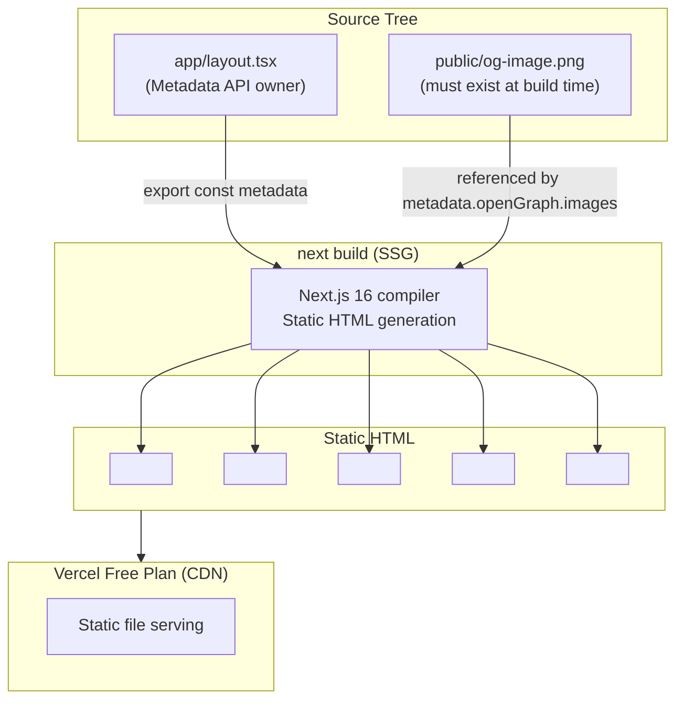
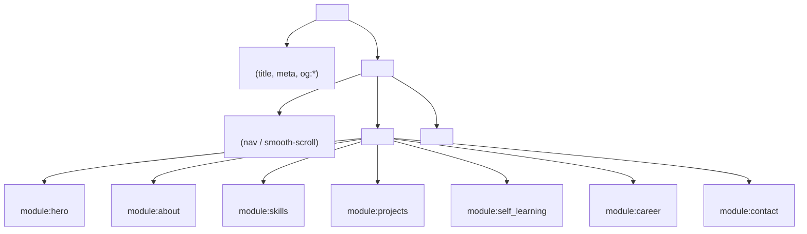
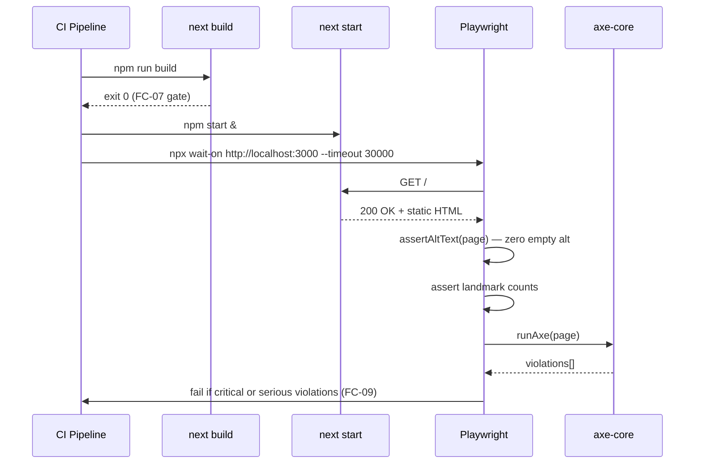

---
codd:
  node_id: design:seo-accessibility-design
  type: design
  depends_on:
  - id: design:system-overview
    relation: depends_on
    semantic: technical
  - id: test:acceptance-criteria
    relation: constrained_by
    semantic: governance
  depended_by:
  - id: plan:implementation-plan
    relation: depends_on
    semantic: technical
  conventions:
  - targets:
    - module:layout
    reason: og:title, og:description, og:image must be exported via the Next.js Metadata
      API in app/layout.tsx; missing OGP fields are a release blocker.
  - targets:
    - module:layout
    reason: title and meta description must be set through the Next.js Metadata API;
      raw <head> manipulation is prohibited in App Router.
  - targets:
    - module:hero
    - module:about
    - module:skills
    - module:projects
    - module:career
    - module:contact
    reason: All sections must use semantic HTML landmarks (section, nav, main, article,
      h1–h6); div-only markup without semantic roles is a release-blocking accessibility
      violation.
  - targets:
    - module:hero
    - module:projects
    reason: All raster images must use next/image with descriptive alt text; bare
       tags and missing alt attributes are release blockers.
  - targets:
    - infra:vercel
    reason: public/og-image.png must exist in the repository at build time; a missing
      OGP image breaks the og:image meta tag.
  modules:
  - layout
  - hero
  - about
  - skills
  - projects
  - career
  - contact
---

# SEO, OGP, and Accessibility Design

## 1. Overview

This document defines the SEO metadata, Open Graph Protocol (OGP), and accessibility architecture for `portforio-v2`, a Next.js 16 App Router static site deployed on the Vercel free plan. The design covers the five required `<head>` metadata elements, semantic HTML landmark requirements, `next/image` alt-text enforcement, axe-core quality gate, and the `public/og-image.png` static asset — all of which are release-blocking constraints.

All metadata is emitted exclusively through the Next.js Metadata API (`export const metadata`) in `app/layout.tsx`. Raw `<head>` manipulation via `next/head` or inline `<head>` tags is prohibited in the App Router and constitutes a release blocker. Because the site is rendered entirely via SSG (`next build`), every metadata element is embedded in static HTML at build time and is accessible to crawlers in JavaScript-disabled environments without any server-side runtime dependency.

The five required `<head>` elements are:

| Element | Metadata API Field | Release Blocker |
|---|---|---|
| `<title>` | `metadata.title` | FC-02 |
| `<meta name="description">` | `metadata.description` | FC-02 |
| `<meta property="og:title">` | `metadata.openGraph.title` | FC-02 |
| `<meta property="og:description">` | `metadata.openGraph.description` | FC-02 |
| `<meta property="og:image">` | `metadata.openGraph.images` → `public/og-image.png` | FC-02, FC-03 |

Any element that is absent, has an empty `content` value, or is duplicated is a release blocker (FC-02). `public/og-image.png` must exist as a valid PNG file in the repository at build time; a missing or unreachable OGP image is a release blocker (FC-03).

Accessibility requirements are enforced at two levels: structural (semantic HTML landmarks, minimum `<section>` count) and content (non-empty `alt` attributes on all `` elements rendered via `next/image`). Zero axe-core violations at `impact: critical` or `impact: serious` is a release-blocking quality gate (FC-09).

---

## 2. Mermaid Diagrams

### 2.1 Metadata Ownership and Build Pipeline



`app/layout.tsx` is the sole canonical owner of all five required metadata fields. No other file may declare or override site-wide `<head>` content. The `public/og-image.png` asset must be committed to the repository; Vercel's build step does not fetch external resources, so a missing file at build time causes a broken `og:image` URL in production (FC-03).

### 2.2 Semantic HTML Landmark Structure



The rendered HTML must contain exactly one `<header>`, one `<main>`, one `<footer>`, and at least seven `<section>` elements. Absence of any of these landmarks is a release blocker (FC-06). Each section must carry a unique `id` attribute matching the smooth-scroll navigation targets: `hero`, `about`, `skills`, `projects`, `self-learning`, `career`, `contact`. Div-only markup without semantic roles on content sections is a release-blocking accessibility violation.

### 2.3 Accessibility Verification Flow



The `axe-runner.ts` helper (`tests/e2e/helpers/axe-runner.ts`) is the single owner of axe-core invocation and violation filtering. All axe scans across `accessibility.browser.spec.ts` must import `runAxe(page)` from this helper; no spec file may duplicate axe setup logic. The helper filters results to `impact: critical` and `impact: serious` before returning; a non-empty result array causes the test to fail.

---

## 3. Ownership Boundaries

### 3.1 `module:layout` — `app/layout.tsx`

`app/layout.tsx` is the exclusive owner of all site-wide SEO and OGP metadata. It must export a single `metadata` constant using the Next.js 16 Metadata API. The following fields are required and must be non-empty strings at build time:

```typescript
export const metadata: Metadata = {
  title: "...",                       // <title>
  description: "...",                 // <meta name="description">
  openGraph: {
    title: "...",                     // og:title
    description: "...",               // og:description
    images: ["/og-image.png"],        // og:image → public/og-image.png
  },
};
```

No page-level metadata override is required because the site has a single route (`/`). If per-route metadata is introduced in a future iteration, `app/layout.tsx` must still provide the fallback values for all five required fields.

Raw `<head>` manipulation (via `next/head`, `<Script strategy="beforeInteractive">` injecting meta tags, or inline JSX within `<head>`) is prohibited in App Router and constitutes a release blocker.

### 3.2 `public/og-image.png` — Infra Ownership

`public/og-image.png` is owned by the repository root and must be committed as a binary asset. It is referenced by the `og:image` metadata field and must resolve to a valid PNG response at the Vercel CDN URL. The file must exist at `next build` invocation time; the build does not generate it dynamically.

Recommended minimum dimensions for SNS platform compatibility (Twitter/X, LinkedIn): 1200×630px. The file must not exceed Vercel's free-plan static asset size limits. The `static-assets` E2E domain (`tests/e2e/static-assets.spec.ts`) asserts that a GET request to the `og:image` URL returns HTTP status < 500 and a `Content-Type` header starting with `image/`.

### 3.3 Content Sections — Semantic HTML Responsibility

Each of the seven content modules owns its own semantic HTML structure:

| Module | Component | Required Landmark | Release Constraint |
|---|---|---|---|
| `module:hero` | `Hero.tsx` | `<section id="hero">` | FC-01, FC-06 |
| `module:about` | `About.tsx` | `<section id="about">` | FC-01, FC-06 |
| `module:skills` | `Skills.tsx` | `<section id="skills">` | FC-01, FC-06 |
| `module:projects` | `Projects.tsx` | `<section id="projects">` | FC-01, FC-06 |
| `module:self_learning` | `SelfLearning.tsx` | `<section id="self-learning">` | FC-01, FC-06 |
| `module:career` | `Career.tsx` | `<section id="career">` | FC-01, FC-06 |
| `module:contact` | `Contact.tsx` | `<section id="contact">` | FC-01, FC-06 |

Each component is responsible for wrapping its content in a `<section>` element with the correct `id`. `app/page.tsx` composes all seven components in sequence inside `<main>`; it does not impose landmark elements on behalf of individual sections.

`module:hero` and `module:projects` additionally own `next/image` usage. Every `<Image>` component within these modules must provide a descriptive, non-empty `alt` prop. `alt=""` is permissible only for images confirmed as purely decorative; all content images require descriptive alt text (FC-05).

### 3.4 Test Helper Ownership

Shared E2E test helpers are owned by `tests/e2e/helpers/` and must not be duplicated in individual spec files:

| Helper | Owned Functionality |
|---|---|
| `axe-runner.ts` | Single axe-core invocation; returns violations filtered to `critical`/`serious` |
| `html-parser.ts` | `getHead(html)`, `getMetaContent(html, name/property)` — parse static HTML `<head>` |
| `dom-assertions.ts` | `assertNoOverflow(page, selector)`, `assertAltText(page)` |
| `viewport-presets.ts` | `MOBILE = { width: 375, height: 812 }`, `DESKTOP = { width: 1280, height: 800 }` |
| `server-health.ts` | `waitForServer(url)` — asserts GET returns status < 500 before test suite begins |

The `seo-metadata` domain (`tests/e2e/seo-metadata.spec.ts`, `tests/e2e/seo-metadata.browser.spec.ts`) owns all `<head>` metadata assertions. The `accessibility` domain (`tests/e2e/accessibility.spec.ts`, `tests/e2e/accessibility.browser.spec.ts`) owns all landmark count, alt-text, and axe-core assertions. These domains are non-overlapping; neither may assert conditions belonging to the other.

---

## 4. Implementation Implications

### 4.1 Next.js Metadata API Compliance (Release-Blocking)

`app/layout.tsx` must use the `export const metadata: Metadata` pattern from `next/metadata`. The Metadata API is the only permitted mechanism for setting `<title>` and `<meta>` tags in the App Router. This constraint is enforced by the following controls:

- CI TypeScript check (`tsc --noEmit`) rejects any use of `next/head` because it is not available in the App Router.
- E2E test `seo-metadata.spec.ts` asserts all five metadata elements are present and non-empty via `getMetaContent` from `html-parser.ts`.
- Any empty `content` attribute on a metadata element causes `seo-metadata.spec.ts` to fail, blocking release (FC-02).

### 4.2 OGP Image Asset Pipeline

`public/og-image.png` must be present before `next build` is invoked. The recommended implementation path:

1. Create a 1200×630px PNG with the author's name and a brief title.
2. Commit the file to `public/og-image.png` in the repository root.
3. Reference it in `metadata.openGraph.images` as `["/og-image.png"]` — Next.js resolves this against the site's base URL at build time.
4. `tests/e2e/static-assets.spec.ts` verifies the URL resolves with `Content-Type: image/png` and status < 500.

No dynamic OGP image generation (e.g., `@vercel/og`, Route Handlers returning `ImageResponse`) is permitted because any Route Handler requiring a Node.js runtime at request time violates the SSG-only constraint (FC-07).

### 4.3 Semantic HTML Implementation Rules

Every content component must use a `<section>` element as its root, not `<div>`. The outer structure assembled in `app/page.tsx` must be wrapped inside `<main>`. `app/layout.tsx` must render `<header>` (containing the smooth-scroll navigation) and `<footer>` as siblings to `{children}` within `<body>`. A concrete skeleton:

```tsx
// app/layout.tsx
export default function RootLayout({ children }: { children: React.ReactNode }) {
  return (
    <html lang="ja">
      <body>
        <header>...</header>
        <main>{children}</main>
        <footer>...</footer>
      </body>
    </html>
  );
}
```

```tsx
// components/Hero.tsx
export default function Hero() {
  return (
    <section id="hero">
      ...
    </section>
  );
}
```

Using `<div id="hero">` without `role="region"` and `aria-label` is a semantic landmark violation and constitutes a release-blocking accessibility defect (FC-06). The minimum landmark count enforced by AC-11 is: one `<header>`, one `<main>`, seven `<section>` elements, one `<footer>`.

### 4.4 `next/image` alt Text Enforcement

All raster images in `module:hero` and `module:projects` must use the `<Image>` component from `next/image` with an explicit `alt` prop. Bare `` tags are prohibited (FC-05). The `alt` prop must be a non-empty descriptive string for content images. The `assertAltText(page)` helper in `dom-assertions.ts` queries all `` elements rendered to the DOM and fails if any has `alt=""` or no `alt` attribute.

`next/image` also requires explicit `width` and `height` props to prevent Cumulative Layout Shift (CLS), which contributes to Core Web Vitals scores relevant to SEO ranking.

### 4.5 axe-core Quality Gate

`tests/e2e/helpers/axe-runner.ts` runs `@axe-core/playwright` against the fully rendered page and filters violations to `impact: critical` and `impact: serious`. The test suite `accessibility.browser.spec.ts` calls `runAxe(page)` after `page.goto('/')` and asserts `violations.length === 0`. Common axe violations to pre-empt during implementation:

| Violation | Prevention |
|---|---|
| `color-contrast` | Verify Tailwind color choices meet WCAG AA ratio (4.5:1 for normal text) |
| `landmark-one-main` | Exactly one `<main>` element in the rendered DOM |
| `region` | All content must be within a landmark element |
| `image-alt` | All `` via `next/image` must have non-empty `alt` |
| `heading-order` | `h1` must appear once in `<header>` or `#hero`; sections use `h2`–`h6` |

### 4.6 Responsive Layout Interaction with SEO

At viewport 375px, `document.documentElement.scrollWidth` must be `<= 375` (FC-04). While this is primarily a layout concern, it intersects with SEO: mobile-first indexing by Google Googlebot crawls at a 375px-equivalent viewport. A horizontally overflowing layout can cause mis-rendered OGP previews when social media crawlers fetch the page. The `responsive.browser.spec.ts` test sets `page.setViewportSize({ width: 375, height: 812 })` before `page.goto('/')` using the `MOBILE` preset from `viewport-presets.ts`.

### 4.7 Release Quality Gate — SEO and Accessibility

A build is release-eligible only when all of the following pass simultaneously:

| Gate | Enforced By |
|---|---|
| Five metadata elements present and non-empty | `seo-metadata.spec.ts` (AC-09, FC-02) |
| `og:image` URL returns `image/png` with status < 500 | `static-assets.spec.ts` (AC-09, FC-03) |
| `public/og-image.png` exists as valid PNG | `static-assets.spec.ts` (VB-25) |
| Zero `` with empty or absent `alt` | `accessibility.spec.ts` (AC-11, FC-05) |
| One `<header>`, one `<main>`, 7+ `<section>`, one `<footer>` | `accessibility.spec.ts` (AC-11, FC-06) |
| Zero axe-core `critical`/`serious` violations | `accessibility.browser.spec.ts` (AC-11, FC-09) |
| `tsc --noEmit` exits 0 | CI pre-test step (AC-12, FC-08) |
| `next build` exits 0 | CI pre-test step (AC-12, FC-07) |

---

## 5. Open Questions

| # | Question | Impact | Source |
|---|---|---|---|
| OQ-004 | `public/og-image.png` has no formally specified dimensions, aspect ratio, or file size. Twitter/X requires 1200×630px and rejects images smaller than 600×314px. LinkedIn recommends 1200×627px. Without a formal specification, the committed PNG may render incorrectly on target platforms even though FC-03 (URL status < 500) passes. Should the static-assets test be extended to assert minimum pixel dimensions via an image-parsing library? | OGP display quality on Twitter/X and LinkedIn | ADR-001-E, AC-09, VB-17, VB-25 |
| OQ-003 | The canonical section count is ambiguous between six (Hero, About, Skills, Projects, Career, Contact in AC-01 prose) and seven (adding Self-Learning, required by FC-01 and FC-06 which list `#self-learning` as a required `id`). AC-11 requires at least 7 `<section>` elements, making seven the operative count. The acceptance criteria document must be updated to resolve this discrepancy so that numeric assertions in `sections-presence.spec.ts` use a single agreed constant. | Correctness of `count === N` assertions in sections-presence and accessibility tests | AC-01, FC-01, FC-06, VB-21 |
| OQ-001 | The CI startup sequence uses `next start`, implying `.next/` build output. `output: 'export'` in `next.config.ts` produces a portable `out/` directory but makes `next start` unavailable. The serve command for `out/` would require `npx serve out` or a static file server. The choice affects how Vercel detects build output and whether the current `npm start` CI step is correct. This must be resolved before the first Vercel deployment is verified. | Build pipeline, Vercel output detection, CI startup command | ADR-001-A (F-001) |
| OQ-SEO-01 | The `<html>` element's `lang` attribute must be set to `"ja"` (Japanese) for correct screen-reader pronunciation and SEO locale signals. If `lang` is absent or set to `"en"`, axe-core will report a `html-has-lang` violation at `serious` impact, blocking release. This should be confirmed as part of the `app/layout.tsx` implementation checklist and validated in `accessibility.spec.ts`. | axe-core FC-09, screen-reader accessibility | AC-11, FC-09 |
